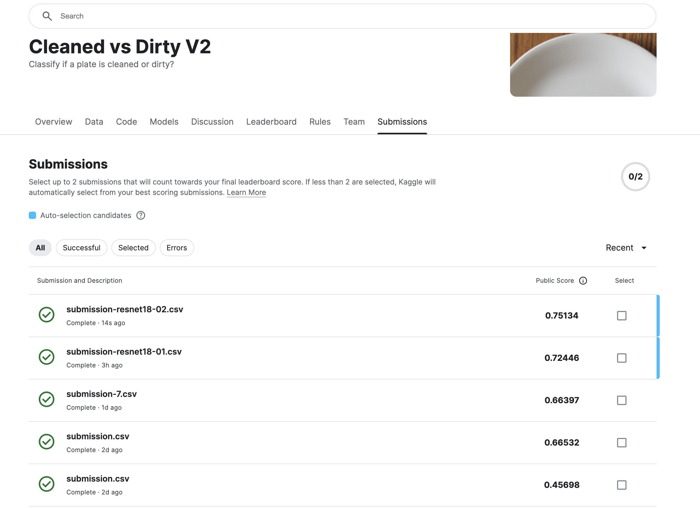

# Cleaned vs Dirty Plates Classification

## Introduction

This project aims to build a deep learning model to classify images of plates as either cleaned or dirty. The dataset consists of images of plates labeled as either cleaned or dirty. Given the small size of the dataset (20 cleaned plates and 20 dirty plates), data augmentation and the use of a pretrained model were essential to achieve good accuracy.

## Author

Carlos Alvarado Martinez

## Project URL

[Kaggle: Cleaned vs Dirty Plates](https://www.kaggle.com/competitions/platesv2/overview)

## Exploratory Data Analysis (EDA) and Data Preprocessing

### EDA

Exploratory Data Analysis (EDA) involves analyzing and visualizing data to extract insights and identify patterns. In this project, the EDA included:

- Showing images from the training and test sets.
- Displaying the number of cleaned and dirty plates.

### Data Preprocessing

Data preprocessing steps included:

1. Resize and save images to 500x500.
2. Apply augmentations to increase the training set size.
3. Create a custom dataset class.
4. Split the dataset into training and validation sets.
5. Load images using PyTorch’s DataLoader.
6. Load pretrained ResNet model.
7. Modify the model for binary classification.
8. Hyperparameter tuning.
9. Train and evaluate the model.
10. Implement early stopping.
11. Calculate precision, recall, and F1-score.
12. Generate submission file.
13. Plot the results.

## Project Architecture - CNN with ResNet-18

The project uses a convolutional neural network (CNN) based on a pretrained ResNet-18 model.

### ResNet-18 Architecture

ResNet-18 is a deep convolutional neural network that belongs to the family of Residual Networks (ResNets). It was designed to solve the problem of vanishing gradients in very deep networks by introducing residual connections. Here’s an overview of its architecture:

1. **Input Layer:**
   - Accepts input images of size 224x224 (in the project, the images are resized to 500x500).

2. **Convolutional Layers:**
   - The network starts with a 7x7 convolutional layer with 64 filters, followed by a max-pooling layer.

3. **Residual Blocks:**
   - The core of ResNet-18 consists of 8 residual blocks. Each block has two convolutional layers with a shortcut connection that adds the input of the block to its output. This helps in preserving the gradient during backpropagation.

4. **Global Average Pooling:**
   - After the residual blocks, a global average pooling layer reduces each feature map to a single value, which reduces the total number of parameters and helps in preventing overfitting.

5. **Fully Connected Layer:**
   - The output from the global average pooling layer is fed into a fully connected (dense) layer that produces the final class scores.

### Modifications for the Project 

In the project, the ResNet-18 model has been fine-tuned for the specific task of binary classification (cleaned vs. dirty plates):

1. **Input Layer:**
   - The input images are resized to 500x500 before being fed into the network.

2. **First Convolutional Layer:**
   - The first convolutional layer of the ResNet-18 is modified to accept 500x500 input images.

3. **Final Fully Connected Layer:**
   - The original fully connected layer, which is designed for 1000-class classification (as in ImageNet), is replaced with a new fully connected layer with 2 outputs (cleaned and dirty).

### Training Process

1. **Data Augmentation:**
   - Various augmentations such as resizing, horizontal and vertical flipping, rotation, and color jittering are applied to the training images to increase the diversity of the training set.

2. **Fine-tuning:**
   - The pretrained weights of ResNet-18 are used, and the model is fine-tuned on the specific dataset. Fine-tuning involves training the network on the data with a small learning rate, allowing the model to adapt the pretrained features to the specific task.

3. **Loss Function:**
   - Cross-entropy loss is used as the loss function, which is standard for classification problems.

4. **Optimizer:**
   - Optimizers like Adam or SGD are used to update the model weights during training. The learning rate and other hyperparameters are tuned to achieve the best performance.

5. **Early Stopping:**
   - Early stopping is implemented to prevent overfitting. Training is stopped when the validation loss stops improving for a certain number of epochs.

### Evaluation Metrics

During training, the model's performance is evaluated using metrics such as accuracy, precision, recall, and F1-score. These metrics help in understanding how well the model is performing in classifying the images correctly.


## Data Augmentation

Data augmentation is a technique used to increase the training set size by applying random transformations to the images, which helps the model generalize better and reduces overfitting. The transformations applied included resizing, horizontal and vertical flipping, rotation, color jitter, and random affine transformations.

## Hyperparameter Tuning

Hyperparameter tuning was performed to find the best set of hyperparameters for the model, such as learning rate, batch size, and optimizer. This process significantly impacts the model's performance.

## Train and Evaluate the Model

Training the model involved:

- Feeding the model with training data.
- Computing the loss.
- Updating the model’s weights to minimize the loss.
- Evaluating the model on a separate validation set.
- Repeating the training process for multiple epochs until the model converges.

Early stopping was implemented to prevent overfitting.

## Plot the Results

The results of training and evaluating the model were visualized by plotting:

- Training and validation loss.
- Validation accuracy.
- Precision, recall, and F1-score.

## Conclusion

In this project, a deep learning model was built to classify images of plates as either cleaned or dirty using a pretrained ResNet-18 model fine-tuned for binary classification. Data augmentation and hyperparameter tuning were essential to improve the model's performance. The model was trained, evaluated, and visualized, with a submission file generated for the Kaggle competition.

## Files

- `notebook.ipynb`: The Jupyter notebook containing the full code implementation.
- `best_model.pth`: The saved model with the best validation accuracy.
- `submission-best.csv`: The submission file generated from the test set predictions.

## Instructions

1. Ensure you have the required libraries installed:
    ```bash
    pip install torch torchvision pandas scikit-learn matplotlib pillow
    ```

2. Run the notebook to preprocess the data, train the model, and generate predictions.

3. Use the `best_model.pth` file to load the trained model for inference.

4. Submit the `submission-best.csv` file to the Kaggle competition.

## Kaggle Competition Score

